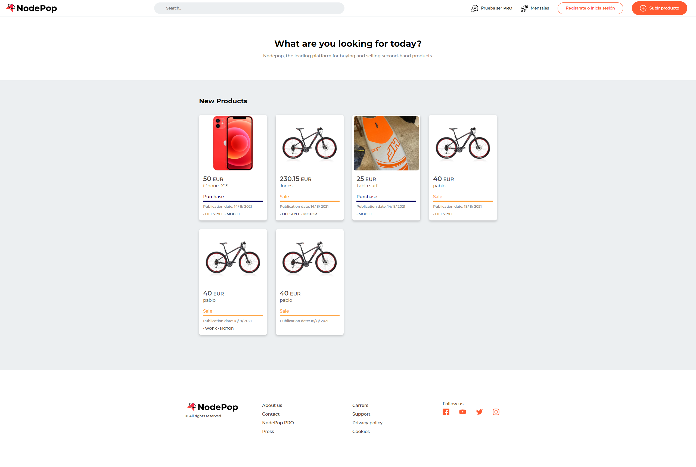
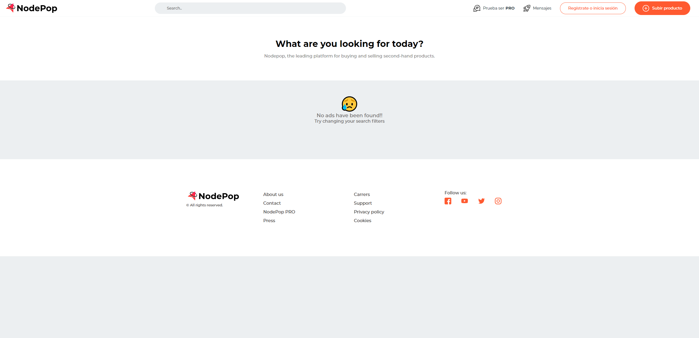

# Entrega de la práctica del módulo 04 Desarrollo backend con Nodejs

  
## Enunciado
La documentación con el enunciado se puede consultar [aquí](documentation/enunciado.pdf)
  
# Proyecto Nodepop

## Arrancar el proyecto

Tras clonar el repositorio que se encuentra en Gitlab:

``` sh

git clone https://gitlab.keepcoding.io/pablopsdigital/web11_modulo04_desarrollo_backend_con_nodejs_practica.git

```

se debe iniciar el proyecto con el comando

```sh

npm install

```

antes de utilizar la aplicación se recomienda cargar datos de ejemplo con los que poder trabajar con los endpoints del api, para ello usamos el comando.

```sh

npm run loadData

```

Los ficheros del script que se ejecuta se encuentran en el directorio **scripts**.

  

Finalmente se podar lanzar una ejecución del servidor en modo desarrollo con el comando

```sh

npm run dev

```

  

## Inicializar la base de datos

  

Para iniciar la base de datos mongoDB usamos el comando

```sh

npm run initDB

```

  

## Inicializar datos de ejemplo

  

Para cargar la base de datos con datos de ejemplo con los que poder trabajar usamos el comando. Los ficheros del script que se ejecuta se encuentran en el directorio scripts.

```sh

npm run loadData

```

  

## Documentación del API v1

Para obtener la información de los endpoinds disponibles en la versión v1 del api debemos cargar la ruta:

  

[http://localhost:300/api/api-docs](http://localhost:3000/api/api-docs/)

  

Dicha documentación está generada con Swagger, y se almacena un fichero de definición en el documento swagger.js en el directorio raíz del proyecto.

  

## Generación de plantillas

En cuanto a la gestión de plantillas y la página publica se ha duplicado el controlador general de filtrado de la consulta, en este caso se podría hacer un servicio que recogiera los parámetros y los enviara al controlador del api, de forma que no se repitiese código.

A continuación se muestran algunas imágenes del frontend y el uso de filtros a través de url como: http://localhost:3000/?skip=1&limit=4

  

En cuanto a las imágenes y estilos se ha optado por situarlos en la carpeta public, además de realizar includes para segmentar los diferentes componentes del frontend depositados en la carpeta views>includes

  



  

